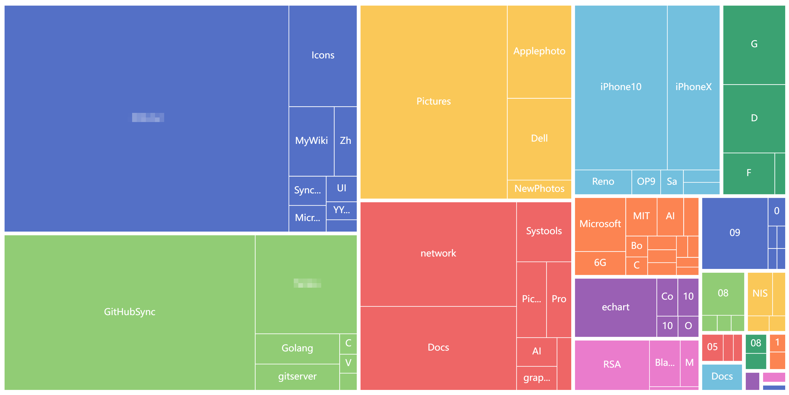

# FolderTree

Want to find out which subdirectory has the highest number of files, and the <a href='https://windirstat.net/'>Windirstat</a> utility only displays them by disk space?

A simple command line tool to get it done quickly!

# ScreenShot

